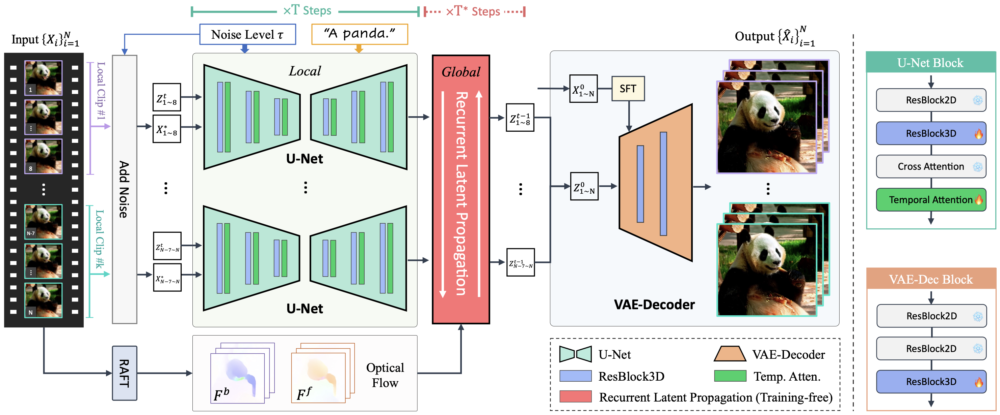

<h1>Upscale-A-Video:  Temporal-Consistent Diffusion Model for Real-World Video Super-Resolution</h1>

    <a href='https://shangchenzhou.com/' target='_blank'>Shangchen Zhou∗</a>&emsp;
    <a href='https://pq-yang.github.io/' target='_blank'>Peiqing Yang∗</a>&emsp;
    <a href='https://iceclear.github.io/' target='_blank'>Jianyi Wang</a>&emsp;
    <a href='https://github.com/Luo-Yihang' target='_blank'>Yihang Luo</a>&emsp;
    <a href='https://www.mmlab-ntu.com/person/ccloy/' target='_blank'>Chen Change Loy</a>

    S-Lab, Nanyang Technological University&emsp; 

    <h4 align="center">
        
        
        
        
    </h4>

<strong>Upscale-A-Video is a diffusion-base model that upscales videos by taking the low-resolution video and text prompts as inputs.</strong>

    

:open_book: For more visual results, go checkout our <a href="##" target="_blank">project page</a>

---

## 🔥 Update
- [2023.12.01] This repo is created.

## 🎬 Overview

## 📧 Contact
If you have any questions, please feel free to reach us out at `shangchenzhou@gmail.com` or `peiqing001@ntu.edu.sg`. 